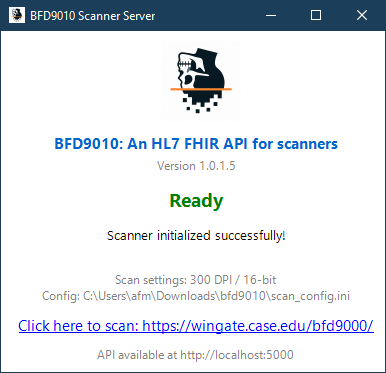

# BFD9010: An HL7 FHIR API for Scanners

- [BFD9010: An HL7 FHIR API for Scanners](#bfd9010-an-hl7-fhir-api-for-scanners)
  - [Quick Start](#quick-start)
    - [Option 1: GUI Application (Recommended for Web Integration)](#option-1-gui-application-recommended-for-web-integration)
    - [Option 2: CLI Application](#option-2-cli-application)
  - [CLI Usage](#cli-usage)
  - [Documentation](#documentation)
    - [Configuration File Structure](#configuration-file-structure)
    - [Configuration Options](#configuration-options)

This software controls the Vidar professional scanners leveraging the proprietary 32-bit Windows DLL and exposes a local FHIR API for web-based scanning.

**Development and deployment require Windows** due to the 32-bit DLL dependency for scanner hardware access. Non-Windows platforms can build and run unit tests only.

## Quick Start

Requires windows. Refer to the [Deployment Checklist](documentation/DEPLOYMENT.md) for installing on a fresh workstation.

1. Download the latest release from GitHub.
2. Run `bfd9010.exe` (GUI application).
   - The scanner will initialize automatically.
   - A small window will appear showing status.
   - The FHIR API server starts on `http://localhost:5000`.
3. Navigate to `https://wingate.case.edu/bfd9000/` to scan.

### Option 1: GUI Application (Recommended for Web Integration)

``` powershell
C:\Users\afm\Downloads\bfd9010>bfd9000.exe
```

- Launches the Windows Forms GUI
- Automatically starts FHIR API server on <http://localhost:5000>
- Displays scanner status in a small always-on-top window
- Shows a clickable link to the web application (configured via `WebAppUrl` in INI file)
- Best for production use with web-based scanner control




### Option 2: CLI Application

``` powershell
C:\Users\afm\Downloads\bfd9010>bfd9000_cli.exe
```

- Launches the interactive command-line interface
- Provides manual control options via keyboard menu:
- Best for testing and manual scanner control

``` text
Looking for Scanner...
Loading scan configuration from: C:\Users\afm\Downloads\bfd9010\scan_config.ini
Output configuration: Format=PNG, Path=C:\Users\afm\Desktop\VidarScans, Prefix=${DPI}DPI_${BIT}BIT
Reading Digitizer Capabilities...
Digitizer Info Retrieved


-------------------------------------------------------------
Digitizer model: DosimetryPRO Advantage
Serial Number: 341870
Firmware version number: 49.7
Hardware version number: 112
Current resolution = 44
Optical resolution = 570
Maximum width in inches = 14
Current Bit Depth = 16
Maximum number of films = 25
Dark Enhance not available
Line Filter not available
Film backup available
Single unloadMedium() command to eject film
Unlimited scans device
Line time range start = 4
Line time range end = 10
Line time current = 8

Feeder type is C (14 inches wide).
Lamp type is a red LED full width roller cartridge.
Translation table selection available.
Translation table location 0 set to Linear, location 1 set to LOG.
-------------------------------------------------------------


Welcome to BFD9010 Scanner Console!  (version: 1.0.1.5)
-------------------------------------------------------------
Available commands (press the key):
  [C]alibrate  - Calibrate the digitizer
  [E]ject      - Eject the film from the digitizer
  [S]can       - Initiate a scan using parameters from scan_config.ini
  [F]HIR API   - Start FHIR REST API server on http://localhost:5000
  [R]estart    - Re-detect scanner and reload configuration
  [Q]uit       - Exit the application
-------------------------------------------------------------
Enter a command: _
```


**FHIR Server:**

```text
Enter a command: f

=================================================================
Starting FHIR API Server...
=================================================================
Loading scan configuration from: C:\Users\afm\Downloads\bfd9010\scan_config.ini
Output configuration: Format=PNG, Path=C:\Users\afm\Desktop\VidarScans, Prefix=${DPI}DPI_${BIT}BIT

Initializing scanner for FHIR API...
Loading scan configuration from: C:\Users\afm\Downloads\bfd9010\scan_config.ini
Output configuration: Format=PNG, Path=C:\Users\afm\Desktop\VidarScans, Prefix=${DPI}DPI_${BIT}BIT
Loading scan configuration from: C:\Users\afm\Downloads\bfd9010\scan_config.ini
Output configuration: Format=PNG, Path=C:\Users\afm\Desktop\VidarScans, Prefix=${DPI}DPI_${BIT}BIT
info: Microsoft.Hosting.Lifetime[14]
      Now listening on: http://localhost:5000
info: Microsoft.Hosting.Lifetime[0]
      Application started. Press Ctrl+C to shut down.
info: Microsoft.Hosting.Lifetime[0]
      Hosting environment: Production
info: Microsoft.Hosting.Lifetime[0]
      Content root path: C:\Users\afm\Downloads\bfd9010
info: BFD9010.FhirApi.Services.ScannerService[0]
      Initializing scanner...
Reading Digitizer Capabilities...
Digitizer Info Retrieved


-------------------------------------------------------------
Digitizer model: DosimetryPRO Advantage
Serial Number: 341870
Firmware version number: 49.7
Hardware version number: 112
Current resolution = 44
Optical resolution = 570
Maximum width in inches = 14
Current Bit Depth = 16
Maximum number of films = 25
Dark Enhance not available
Line Filter not available
Film backup available
Single unloadMedium() command to eject film
Unlimited scans device
Line time range start = 4
Line time range end = 10
Line time current = 8

Feeder type is C (14 inches wide).
Lamp type is a red LED full width roller cartridge.
Translation table selection available.
Translation table location 0 set to Linear, location 1 set to LOG.
-------------------------------------------------------------


info: BFD9010.FhirApi.Services.ScannerService[0]
      Scanner initialized successfully: DosimetryPRO Advantage

√ Scanner initialized successfully!

CORS configured for: https://wingate.case.edu

=================================================================
FHIR API Server is running on http://localhost:5000
=================================================================

Available endpoints:
  GET  /Device/{id}         - Get scanner information
  POST /Device/{id}/$scan   - Perform scan
  POST /Device/{id}/$calibrate - Calibrate scanner
  POST /Device/{id}/$eject  - Eject film

Web application: https://wingate.case.edu/bfd9000/

Press Ctrl+C to stop the server and return to menu...
=================================================================
```

**When to use CLI:**

- Debugging scanner connectivity or status
- Manual calibration/eject operations
- Verifying scan output without the web UI

**Command-line options (both CLI and GUI):**

``` powershell
bfd9010_cli.exe --config path\to\config.ini
bfd9010.exe --config path\to\config.ini
```

## CLI Usage

Run `bfd9010_cli.exe` for the interactive command-line interface.

## Documentation

- Build, run, packaging, configuration: `documentation/BUILD_AND_RUN.md`
- FHIR API endpoints: `documentation/API.md`
- Deployment checklist: `documentation/DEPLOYMENT.md`
- Multi-scanner architecture: `documentation/MULTI_SCANNER_ARCHITECTURE.md`
- Reverse engineering notes: `documentation/vidar/RE_Writeup.md`

### Configuration File Structure

Example `scan_config.ini`:

```ini
[ScanParameters]

# Bit depth (8 or 16)
BitDepth = 16

# DPI resolution (tested DPIs: 75, 150, 300)
DPI = 300

# Output options
# OutputPath: directory where image files will be written
OutputPath = ~\Desktop\VidarScans

# OutputPrefix: filename prefix template. Tokens: ${DPI}, ${BIT}
OutputPrefix = ${DPI}DPI_${BIT}BIT

# Web API settings
# WebAppUrl: URL of the web application users should navigate to for scanning
WebAppUrl = https://wingate.case.edu/bfd9000/

# CorsOrigin: CORS origin(s) to allow API access from (comma-separated for multiple)
CorsOrigin = https://wingate.case.edu
```

### Configuration Options

| Option | Type | Default | Description |
|--------|------|---------|-------------|
| `BitDepth` | integer | 16 | Scan bit depth (8 or 16) |
| `DPI` | integer | 300 | Scan resolution in dots per inch (tested: 75, 150, 300) |
| `OutputPath` | string | `~\Desktop\VidarScans` | Directory for saving scanned images (supports ~ for home directory) |
| `OutputPrefix` | string | `${DPI}DPI_${BIT}BIT` | Filename prefix template (tokens: ${DPI}, ${BIT}) |
| `WebAppUrl` | string | `https://wingate.case.edu/bfd9000/` | URL displayed in GUI for users to access web interface |
| `CorsOrigin` | string | `https://wingate.case.edu` | Allowed CORS origin(s), comma-separated for multiple origins |
